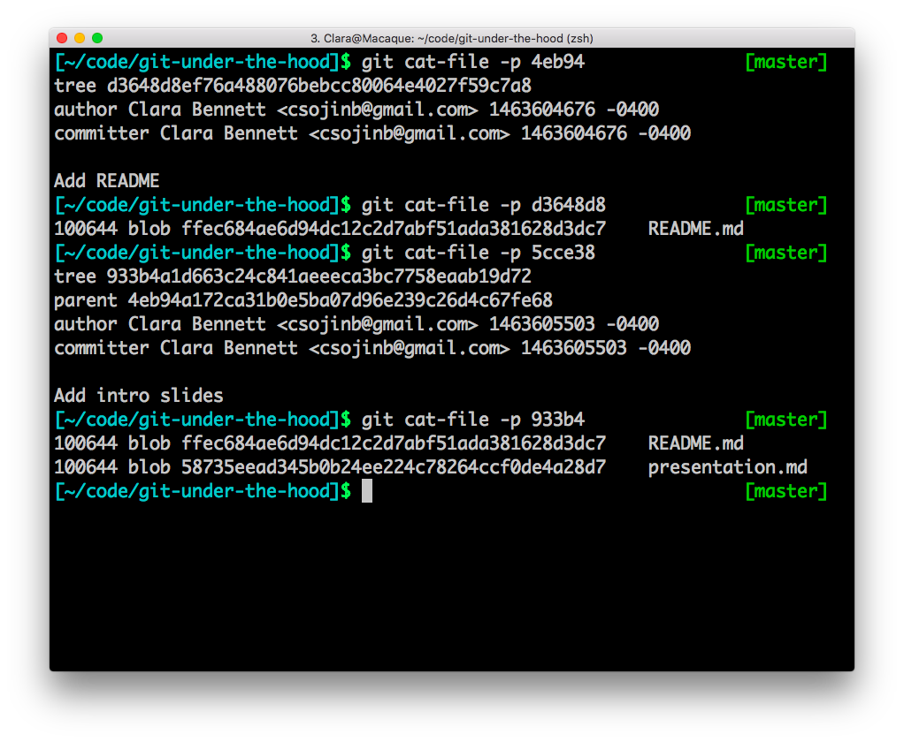
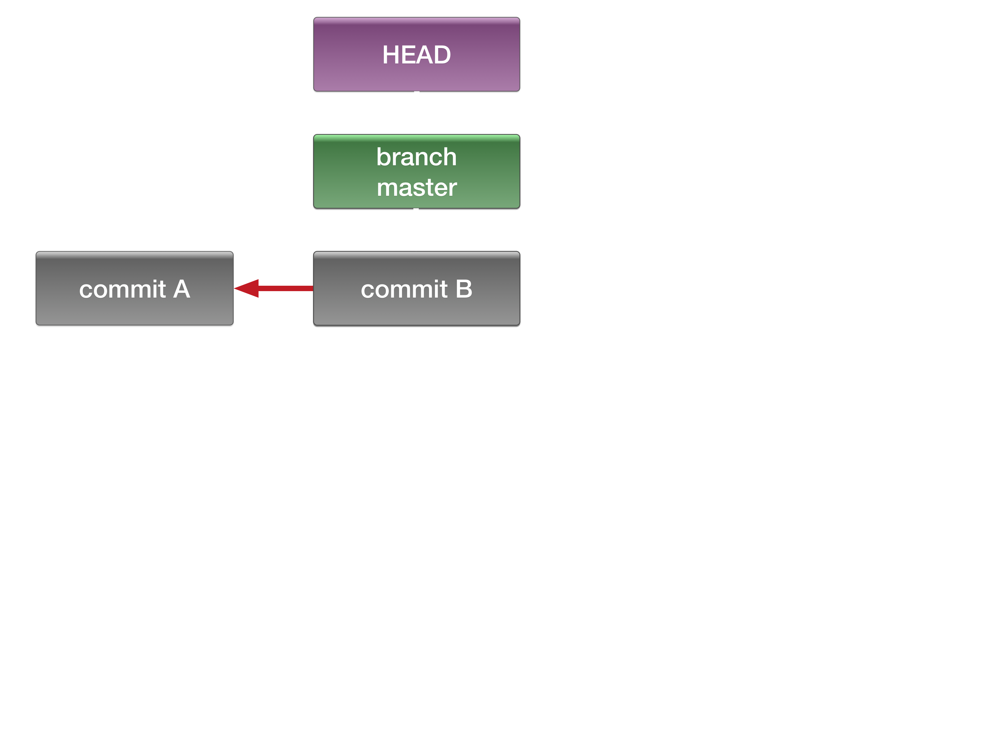
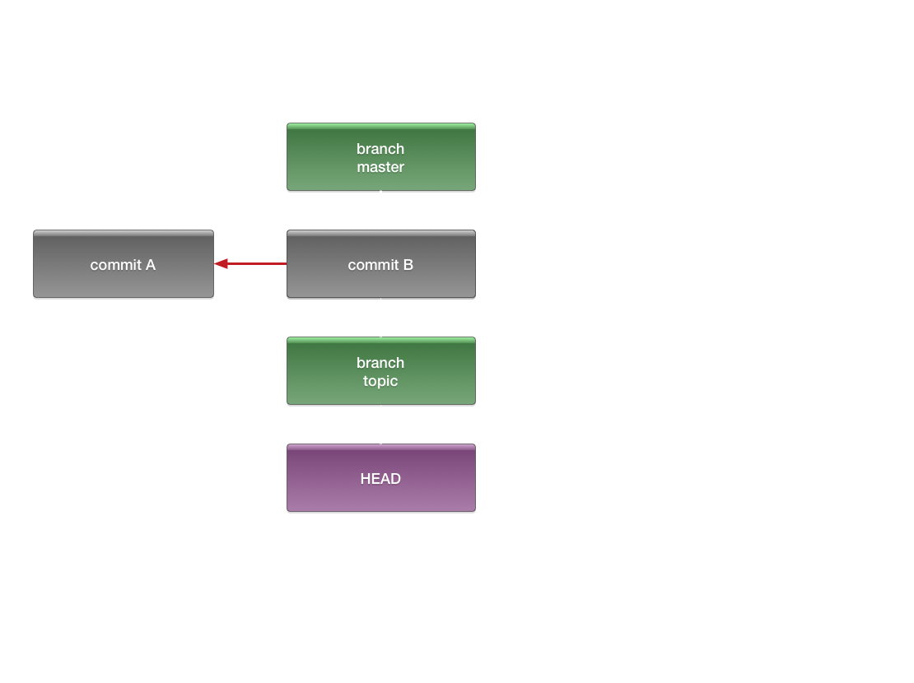
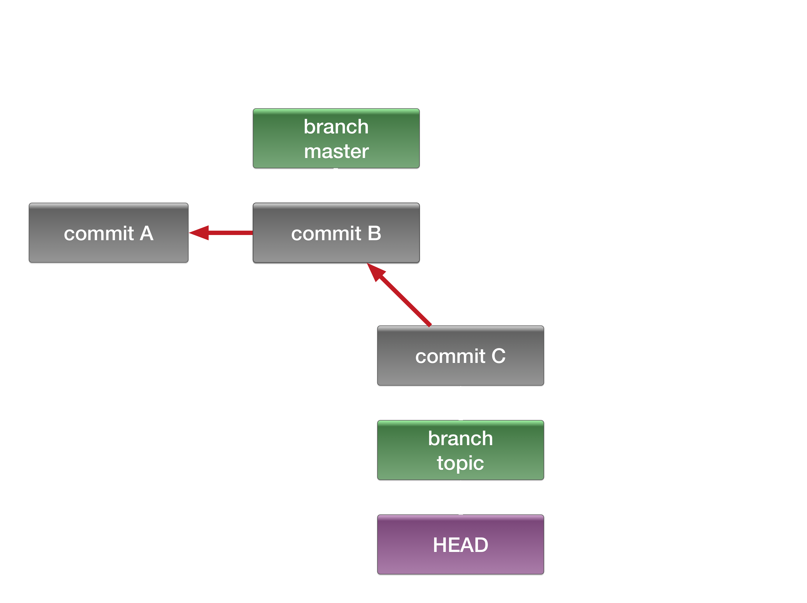
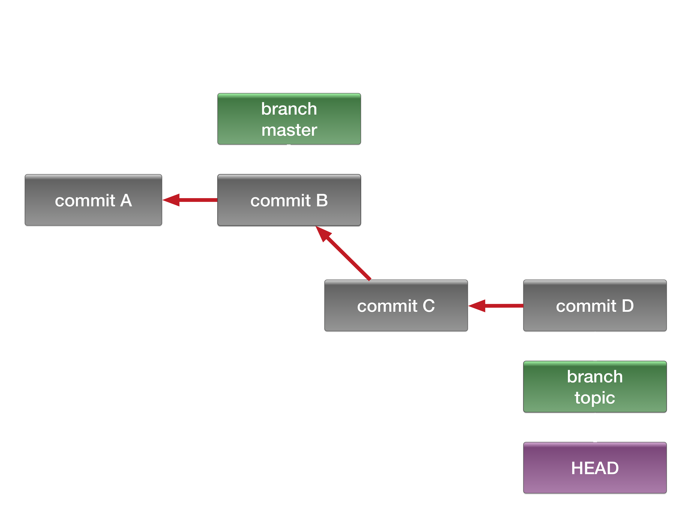
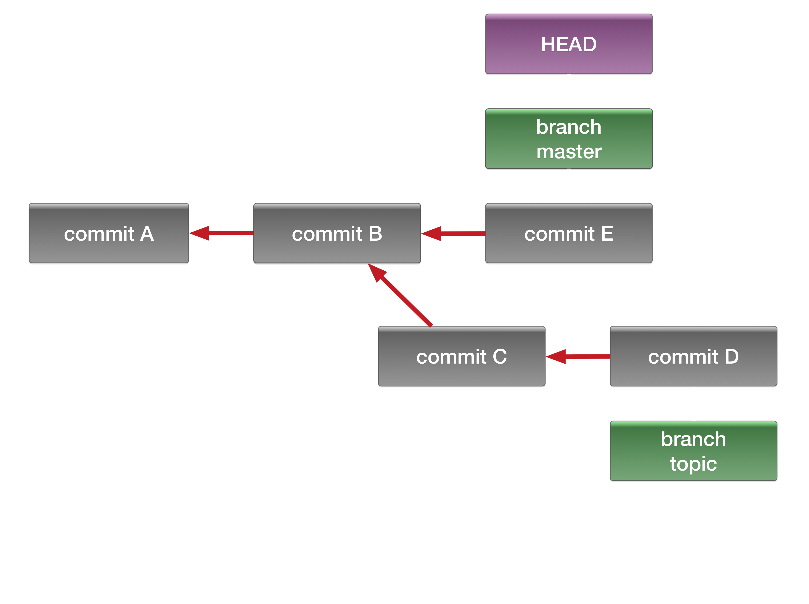
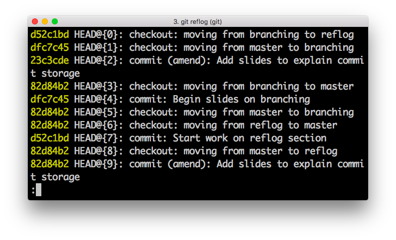
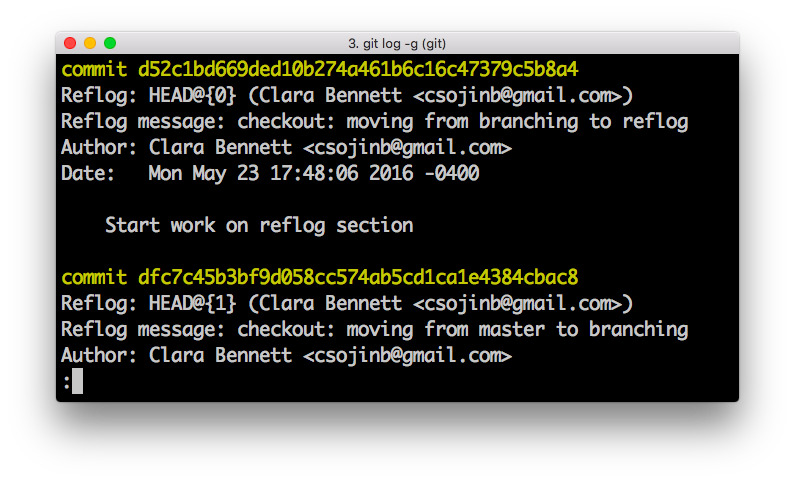
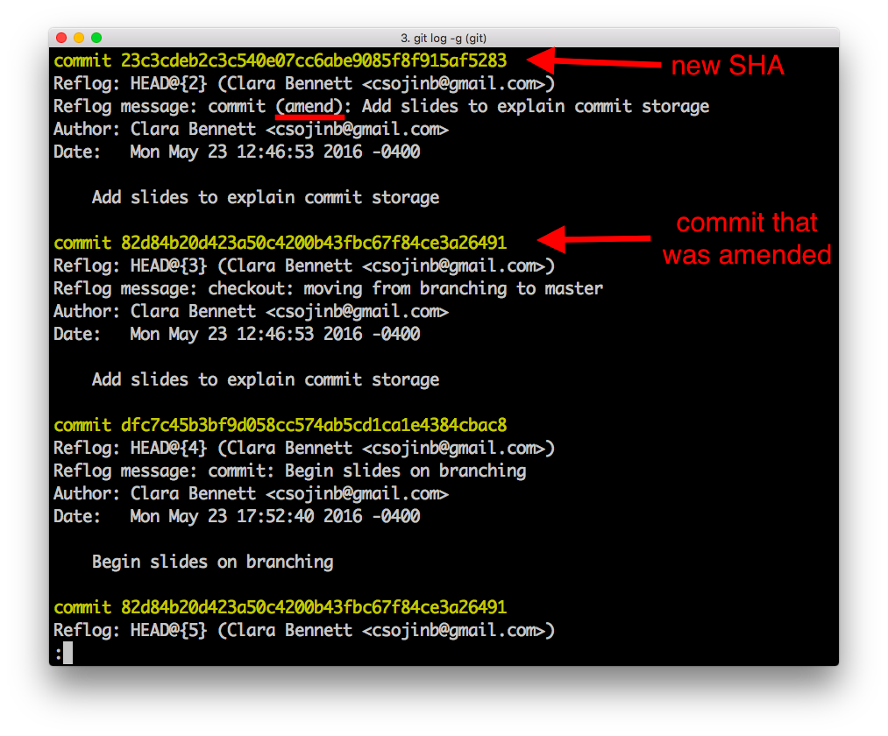

slidenumbers: true

# Git
## A Peek Under the Hood

### Clara Bennett
### PyCon 2016


---
# My Goal

_To improve your mental model of **git** and give you tools to continue learning and become a more effective git user._


This talk is not:

* An introduction to git for novice users
* A tutorial in "advanced" git techniques
* Related to **GitHub** in any way

---

# What is stored when you commit?


---
# The Snapshot
## (i.e. the content)

* When changes are staged, each affected file and directory entity is check-summed, compressed, and stored separately[^1]
* Directory entities (including the project root) point to the SHA-1 checksums of the files and directories they contain


[^1]: Eventually, git will compress versions of the same file together to save space when necessary, e.g. if you want to push to a remote. But looking up the file by checksum will still return you the complete file.

---

# The Commit
## (i.e. content + meta-data)

* Pointer a top-level directory snapshot[^2]
* Commit message
* Author and committer
* Pointer(s) to parent commit(s)

[^2]: Thus, commit objects have access to the _complete state_ of the project at that point in history.

---

 

---


# Representing Changes

* Git does not directly save any _actions_ that you took, only the state
* Differences are _derived_ by comparing snapshots
* Actions are _inferred_
* Ex: git recognizes the rename because the file contents is the same

---

# Branches, History, and Navigation


---
# The Commit "Tree"[^3]

* As previously mentioned, commits know about their parents
* Together, the commits and parent relations form the commit "tree", or history
* Multiple commits can have the same parent, which forms a natural "branching" structure

[^3]: Technically, it's not quite a tree, because merge commits have two or more parents. But, it seems easier to think about as an almost-tree than as a rooted connected directed acyclic graph. :sweat_smile:

---
# Branches Are Just Pointers

* A git branch is represented as a reference to a commit (which defines the "end" of the branch)
* The branch reference moves forward if new commits are added[^4] while that branch is checked out
* Deletion of a branch amounts to deletion of _the pointer only_: the commits are still in the database

[^4]: This is in contrast to tags (similarly just pointers to commits), which stay put unless explicitly moved.

[^*]: This is in contrast to tags (similarly just pointers to commits), which stay put unless explicitly moved.
---
# Where am I?

* The `HEAD` reference determines what is "checked out"
* If a branch is checked out, `HEAD` points to the branch ref
* The "unattached HEAD" state occurs when `HEAD` points directly to a commit
* Either way, the associated snapshot is identical[^5] to the state of the working directory

[^5]: Assuming that the working directory is clean, that is.

---
```
[~/dev/repo]$ git clone url .
```



---
```
[~/dev/repo](master)$ git checkout -b topic
```



---
```
[~/dev/repo](topic)$ git commit
```



---
```
[~/dev/repo](topic)$ git commit
```



---
```
[~/dev/repo](topic)$ git checkout master; git pull
```



---
# The Reflog
## Understand your actions and get out of trouble

---
# What is the reflog?

* The reflog is a **local-only** log of all changes to git _ref(erence)s_, which are pointers to git objects
    - Refs include: branches, tags, HEAD
* A freshly cloned repo has an empty reflog
* The reflog can help you understand how your actions affect the commit tree
* The reflog can be used to **return to a previous state**

---
# What can I find in the reflog?

* Some of the changes recorded in the reflog:
    - new commits (including merge commits, cherry-picks)
    - modifications to commits
    - branch or commit checkouts
* Things that are not recorded in the reflog:
    - fetches
    - pushes to a remote

---
# View the reflog

 

---
# Example
## Recover a modified commit



* Recall that commit "modification" actually creates a _new_ commit
* Previous "version" still exists
* Can create new branch to point to old commit:
`$ git branch recovery 82d84b2`
* Same technique can be used to recover a branch that was deleted

---

## @csojinb


